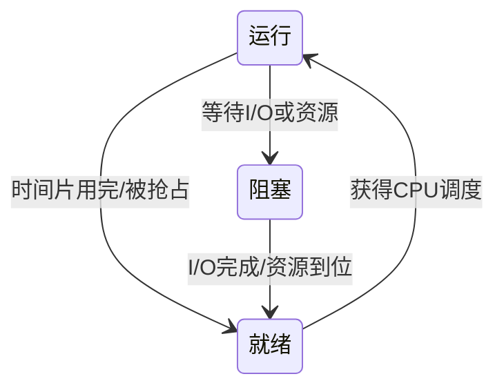
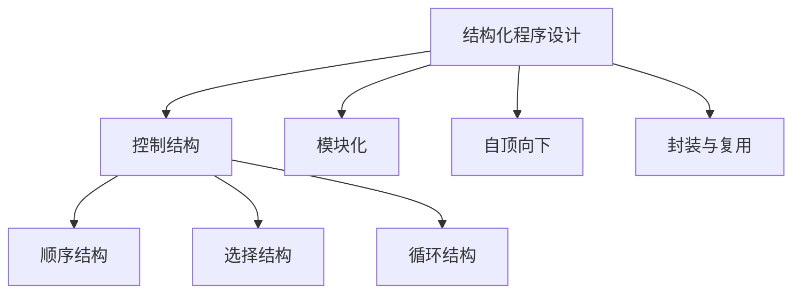

# 计算机原理

## 计算与计算机模型

### 计算的定义

计算可以从三个层次来理解：

1. **以数字为基础**的计算——遵循计算规则进行加减乘除、微分积分等数学运算
2. **广义计算**——把符号串 $f$ 变换成符号串 $g$
3. **更广义计算**——对信息的变换

计算规则的**机械化、公式化**，使得计算可借助计算工具实现，从而催生了计算机的诞生。

### 可编程结构与图灵机

<figure markdown="span">
  { loading=lazy width="70%" }
</figure>

**可编程结构**和**图灵机**都是计算机的数学模型。图灵机提出了一种**离散的、有穷的、构造性**的问题求解思路：

<figure markdown="span">
  { loading=lazy width="70%" }
</figure>

???+ note "图灵可计算性"
    凡能用算法方法解决的问题，一定能用图灵机解决；反之，图灵机无法解决的问题，也不存在算法解法。这一论断被称为**丘奇-图灵论题**（Church-Turing Thesis）。

### 巴贝奇分析机

巴贝奇分析机可视为现代计算机的雏形，其结构分为四部分：

存贮仓库（Store）
: 存放数据和中间结果，相当于现代计算机的存储器

运算装置（作坊）
: 执行运算操作，相当于现代计算机的运算器

控制装置
: 控制运算顺序和操作流程，相当于现代计算机的控制器

输入输出部件
: 接收外部数据并输出结果

!!! tip "历史意义"
    巴贝奇分析机的设计思想已包含"存储程序"的萌芽——数据与指令均可存放在存贮仓库中，由控制装置按序调度执行。

## 冯诺依曼体系结构

冯诺依曼体系结构是现代计算机的理论基础，其核心特点如下：

1. 指令和数据采用**二进制**表示
2. 指令和数据一样存储在**主存储器**中（存储程序思想）
3. 计算机由**运算器、控制器、存储器、输入设备、输出设备**五大部分组成

### 计算机工作原理

程序预先存储在主存储器中，计算机在程序控制下运行。控制器负责协调各部件，其工作过程遵循 **"取指令 → 分析指令 → 执行指令"** 的循环：

???+ details "取指-分析-执行 详解"
    - **取指令**：控制器从主存储器中按地址取出下一条要执行的指令
    - **分析指令**：对指令进行译码，确定操作类型和操作数地址
    - **执行指令**：根据分析结果，由运算器完成相应运算，或由 I/O 设备完成数据传送

### 计算机系统组成

计算机系统由**硬件**和**软件**两大部分组成：

硬件系统
: 运算器、控制器、存储器、输入设备、输出设备等物理部件

软件系统
: 系统软件（如操作系统、编译程序）和应用软件（如文字处理、图像编辑）

!!! warning "内存与外存的区别"
    - **内存（主存储器）**：存取速度快，容量相对较小，断电后信息丢失（RAM），CPU 可直接访问
    - **外存（辅助存储器）**：存取速度慢，容量大，断电后信息不丢失（如硬盘、SSD），CPU 不能直接访问，需先调入内存

## 操作系统与进程

### 操作系统概述

操作系统是最基本、最重要的**系统软件**，直接运行在裸机（硬件）上，为上层软件和用户提供运行环境。其主要功能包括：

| 管理功能 | 说明 |
|----------|------|
| 作业管理 | 调度和控制用户作业的执行 |
| 进程管理 | 创建、调度、撤销进程，管理进程并发 |
| 内存管理 | 内存分配与回收、地址映射、内存保护 |
| 设备管理 | I/O 设备的分配、驱动和调度 |
| 文件管理 | 文件的创建、删除、读写、权限控制 |

### 进程

进程
: 具有一定独立功能的程序关于某个数据集合的一次运行活动

进程与程序的关系：

| 对比维度 | 程序 | 进程 |
|----------|------|------|
| 性质 | 静态（指令序列的文本） | 动态（程序的执行过程） |
| 并发性 | 不具备并发性 | 具有并发性 |
| 对应关系 | 一个程序可对应多个进程 | 一个进程只对应一个程序 |

### 进程状态转换

进程在其生命周期中会在三种状态间切换：

运行（Running）
: 进程正在 CPU 上执行

就绪（Ready）
: 进程已具备运行条件，等待 CPU 分配

阻塞（Blocked / Waiting）
: 进程因等待 I/O 操作或资源而暂停

???+ note "状态转换要点"
    - 运行 → 就绪：时间片用完或被高优先级进程抢占
    - 就绪 → 运行：被调度程序选中获得 CPU
    - 运行 → 阻塞：主动请求 I/O 或等待资源（**只有运行态的进程才能主动进入阻塞态**）
    - 阻塞 → 就绪：等待的事件完成，被唤醒（**阻塞态不能直接进入运行态，必须先进入就绪态**）

## 程序设计基础概念

### 指令与程序

指令
: 由"0"和"1"组成的二进制码，是计算机**唯一可以直接识别**的语言

指令系统
: 计算机能直接识别和执行的全部指令的集合

程序
: 按事先设计的功能和性能要求编制的**指令序列**

!!! tip "关键区分"
    指令是最基本的操作单元，指令系统是硬件层面的能力边界，程序则是人利用指令系统编制的逻辑序列——三者构成"操作 → 能力 → 应用"的层次关系。

### 语言层次

| 语言类型 | 特点 |
|----------|------|
| 机器语言 | 由 0/1 二进制码组成，计算机唯一可直接识别和执行的语言，编写困难、可读性差 |
| 符号语言（汇编语言） | 用符号或助记符表示机器语言指令，与机器语言一一对应，仍依赖具体硬件 |
| 高级语言 | 接近自然语言和数学表达，独立于具体硬件，可移植性好，需经翻译程序转换为机器语言 |

预处理程序
: 对源程序中的宏定义、文件包含等预处理指令进行展开和替换

翻译程序
: 将高级语言或汇编语言程序翻译为机器语言程序，包括**编译程序**（整体翻译）和**解释程序**（逐行翻译）

链接程序
: 将多个目标模块和库文件链接成一个可执行程序，解决外部引用和地址重定位

载入程序
: 将可执行程序从外存载入内存，分配运行所需的内存空间并启动执行

### C 语言编程活动

C 程序的完整开发流程为 **编辑 → 编译 → 链接 → 运行**：

### 算法

算法
: 完成一个任务或解决问题的**步骤序列**

算法是程序的核心逻辑，与数据结构共同构成程序的两大支柱。

### 有限状态机

有限状态机（Finite State Machine, FSM）
: 表示有限个状态以及状态间转移和动作的**数学模型**

FSM 的三要素：

状态（State）
: 存储关于过去的信息，反映从系统开始到现在的输入变化

转移（Transition）
: 指示状态变更，必须满足的条件来描述

动作（Action）
: 在给定时刻要进行的活动的描述

???+ tip "FSM 与计算机原理的联系"
    FSM 是理解计算机底层操作的重要模型——CPU 的指令执行循环（取指→分析→执行）本质上就是一个有限状态机；编译器中的词法分析也依赖 FSM 来识别 token。

## 结构化程序设计

结构化程序设计的主要内容包括：

1. **控制结构**：程序仅使用顺序、选择（分支）、循环三种基本控制结构
2. **模块化**：将程序划分为功能独立的模块（子程序/函数）
3. **自顶向下**：从整体功能出发，逐步细化到具体实现
4. **封装与复用**：通过子程序封装功能逻辑，避免重复代码

过程化程序设计
: 实现计算的操作过程和步骤，用编程语言描述——即"先做什么、再做什么"的步骤式编程范式

程序的基本要素：

- **数据与运算表达式**：定义操作对象和计算规则
- **输入输出**：与外部交互的接口
- **控制结构**：决定执行流程的走向
- **子程序（函数）**：封装可复用的功能单元
