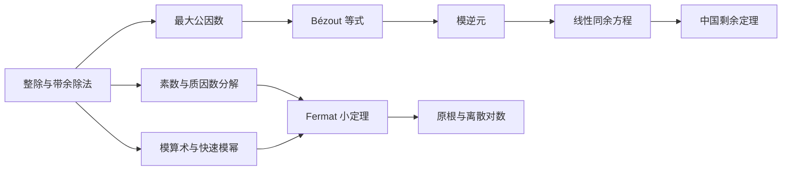

# 初等数论

初等数论研究整数的整除、素数以及同余关系。在离散数学中，这些概念不仅用于证明整数命题，也是快速模幂、密码算法和计算机整数运算的基础。

本文的知识链可以概括为：



## 整除

整除 (Divisibility)
: 对整数 $a,b$，若存在整数 $c$ 使得

    $$b=ac,$$

    则称 **$a$ 整除 $b$**，记作 $a\mid b$；也称 $b$ 被 $a$ 整除。若不存在这样的整数 $c$，则记作 $a\nmid b$。

例如，$3\mid 12$，因为 $12=3\times4$；但 $5\nmid 12$。

!!! note "零与整除"

    对任意整数 $a$ 都有 $a\mid0$，因为 $0=a\cdot0$。反过来，$0\mid b$ 仅在 $b=0$ 时成立。

### 整除的基本性质

设 $a,b,c,m,n\in\mathbb Z$，则有：

1. 若 $a\mid b$ 且 $a\mid c$，则 $a\mid(b+c)$；
2. 更一般地，若 $a\mid b$ 且 $a\mid c$，则

    $$a\mid(mb+nc);$$

3. 若 $a\mid b$，则 $a\mid bc$；
4. 若 $a\mid b$ 且 $b\mid c$，则 $a\mid c$。

???+ details "线性组合性质的证明"

    由 $a\mid b$、$a\mid c$，存在 $s,t\in\mathbb Z$ 使 $b=as$、$c=at$。于是

    $$mb+nc=m(as)+n(at)=a(ms+nt),$$

    而 $ms+nt\in\mathbb Z$，所以 $a\mid(mb+nc)$。

## 带余除法与模运算

### 带余除法定理

!!! abstract "带余除法定理"

    对任意整数 $b$ 和非零整数 $a$，存在唯一的整数 $q,r$，使得

    $$b=aq+r,\qquad 0\le r<|a|.$$

    其中 $q$ 为商，$r$ 为余数。

在程序设计语言中，商和余数常分别写作 `b div a` 与 `b mod a`。数学上通常规定余数非负，因此负数除法也要满足 $0\le r<|a|$。

!!! example "负数的余数"

    计算 $-11$ 除以 $4$：

    $$-11=4\times(-3)+1.$$

    所以商为 $-3$，余数为 $1$，即

    $$-11\bmod4=1.$$

### 模 $m$ 算术

对正整数 $m$，模 $m$ 的标准剩余类代表元组成集合

$$\mathbb Z_m=\{0,1,\ldots,m-1\}.$$

在 $\mathbb Z_m$ 中定义加法和乘法：

$$
a+_m b=(a+b)\bmod m,\qquad
a\cdot_m b=(ab)\bmod m.
$$

例如，在 $\mathbb Z_{11}$ 中：

$$7+_{11}9=16\bmod11=5,$$

$$7\cdot_{11}9=63\bmod11=8.$$

## 模同余

模同余 (Congruence)
: 设 $m$ 为正整数。若 $m\mid(a-b)$，则称 $a$ 与 $b$ **模 $m$ 同余**，记作

    $$a\equiv b\pmod m.$$

下面三个条件彼此等价：

$$
\begin{aligned}
a&\equiv b\pmod m,\\
m&\mid(a-b),\\
a\bmod m&=b\bmod m.
\end{aligned}
$$

等价地，存在 $k\in\mathbb Z$ 使得 $a=b+km$。

### 同余的性质

模 $m$ 同余是整数集上的等价关系，满足自反性、对称性与传递性。如果

$$a\equiv b\pmod m,\qquad c\equiv d\pmod m,$$

那么

$$a+c\equiv b+d\pmod m,$$

$$ac\equiv bd\pmod m.$$

因此可以在计算过程中随时将一个数替换为与它同余、但更容易处理的数。

!!! warning "同余式不能随意约分"

    从 $ac\equiv bc\pmod m$ 直接推出 $a\equiv b\pmod m$ 并不总是成立。若 $\gcd(c,m)=1$，则 $c$ 在模 $m$ 下存在逆元，此时才可以消去 $c$。

    一般地，若 $d=\gcd(c,m)$，则只能推出

    $$a\equiv b\pmod{m/d}.$$

## 整数的进位制表示

设 $b\ge2$。任意非负整数 $n$ 都可以唯一写为

$$n=a_kb^k+a_{k-1}b^{k-1}+\cdots+a_1b+a_0,$$

其中 $0\le a_i<b$ 且 $a_k\ne0$。简记为

$$n=(a_ka_{k-1}\cdots a_1a_0)_b.$$

二进制取 $b=2$，每一位只能是 $0$ 或 $1$。例如：

$$
(1011)_2=11,\qquad (1001)_2=9.
$$

二进制加法与乘法仍使用逐位运算：

$$
\begin{aligned}
(1011)_2+(1001)_2&=(10100)_2,\\
(1011)_2\times(1001)_2&=(1100011)_2.
\end{aligned}
$$

## 快速模幂

直接计算 $b^n$ 再取模会产生极大的中间数。快速模幂（平方—乘算法）利用指数的二进制表示，在每一步都取模，把乘法次数降为 $O(\log n)$。

若

$$n=(n_kn_{k-1}\cdots n_1n_0)_2=\sum_{i=0}^{k}n_i2^i,$$

其中 $n_i\in\{0,1\}$，则

$$b^n=\prod_{i=0}^{k}\left(b^{2^i}\right)^{n_i}.$$

依次平方即可得到 $b,b^2,b^4,b^8,\ldots$ 在模 $m$ 下的余数，只把二进制位为 $1$ 的项乘入答案。

```python title="快速模幂"
def modular_power(base: int, exponent: int, modulus: int) -> int:
    if exponent < 0 or modulus <= 0:
        raise ValueError("exponent must be nonnegative and modulus positive")

    result = 1 % modulus
    power = base % modulus

    while exponent > 0:
        if exponent % 2 == 1:
            result = result * power % modulus
        power = power * power % modulus
        exponent //= 2

    return result
```

!!! example "计算 $123^{1001}\bmod101$"

    因为 $123\equiv22\pmod{101}$，且

    $$1001=(1111101001)_2=2^9+2^8+2^7+2^6+2^5+2^3+2^0,$$

    所以只需重复平方，并在上述二进制位处累乘。各次平方的余数为：

    | $i$ | $22^{2^i}\bmod101$ | 是否乘入答案 |
    |---:|---:|:---:|
    | 0 | 22 | 是 |
    | 1 | 80 | 否 |
    | 2 | 37 | 否 |
    | 3 | 56 | 是 |
    | 4 | 5 | 否 |
    | 5 | 25 | 是 |
    | 6 | 19 | 是 |
    | 7 | 58 | 是 |
    | 8 | 31 | 是 |
    | 9 | 52 | 是 |

    最终得到

    $$123^{1001}\equiv22\pmod{101}.$$

## 素数与质因数分解

素数 (Prime)
: 大于 $1$ 且正因数只有 $1$ 和自身的正整数。

合数 (Composite)
: 大于 $1$ 且不是素数的正整数。

!!! warning "$1$ 既不是素数，也不是合数"

    这一约定保证了质因数分解的唯一性。例如，若把 $1$ 视为素数，则 $6=2\cdot3=1\cdot2\cdot3=1^2\cdot2\cdot3=\cdots$，分解不再唯一。

### 算术基本定理

!!! abstract "算术基本定理"

    每个大于 $1$ 的正整数都能表示为素数的乘积；忽略素因子的排列次序后，这种表示唯一。

因此任意 $n>1$ 都可以唯一写成

$$n=p_1^{\alpha_1}p_2^{\alpha_2}\cdots p_k^{\alpha_k},$$

其中 $p_1<p_2<\cdots<p_k$ 为素数，$\alpha_i$ 为正整数。

### 试除法

!!! abstract "试除判定"

    若 $n>1$ 是合数，则 $n$ 至少有一个不超过 $\sqrt n$ 的素因子。

???+ details "为什么只需检查到 $\sqrt n$"

    若 $n=ab$ 且 $1<a\le b<n$，那么不可能同时有 $a>\sqrt n$、$b>\sqrt n$，否则 $ab>n$。因此较小的因子必不超过 $\sqrt n$，而它自身又含有一个不超过它的素因子。

据此判断 $n$ 是否为素数时，只需尝试用不超过 $\sqrt n$ 的素数去除 $n$。

### Mersenne 数

形如

$$M_p=2^p-1$$

的数称为 Mersenne 数。若 $M_p$ 是素数，则称为 Mersenne 素数。

!!! warning "指数是素数并不足以保证 $M_p$ 为素数"

    当 $2^p-1$ 为素数时，$p$ 必须是素数；但反命题不成立。例如 $p=11$ 是素数，而

    $$2^{11}-1=2047=23\times89$$

    是合数。

## 最大公因数与 Euclid 算法

最大公因数 (Greatest Common Divisor)
: 同时整除 $a,b$ 的正整数中最大的一个，记作 $\gcd(a,b)$。

最小公倍数 (Least Common Multiple)
: 同时被 $a,b$ 整除的正整数中最小的一个，记作 $\operatorname{lcm}(a,b)$。

对非零整数 $a,b$，有

$$\gcd(a,b)\operatorname{lcm}(a,b)=|ab|.$$

### Euclid 算法

若 $a=bq+r$，则

$$\gcd(a,b)=\gcd(b,r).$$

反复使用带余除法，直到余数为 $0$，最后一个非零余数就是最大公因数。

!!! example "计算 $\gcd(252,105)$"

    $$
    \begin{aligned}
    252&=105\times2+42,\\
    105&=42\times2+21,\\
    42&=21\times2+0.
    \end{aligned}
    $$

    所以 $\gcd(252,105)=21$。

### Bézout 等式与扩展 Euclid 算法

!!! abstract "Bézout 等式"

    对不全为 $0$ 的整数 $a,b$，存在整数 $s,t$ 使得

    $$sa+tb=\gcd(a,b).$$

    $sa+tb$ 的所有整数线性组合中，最小的正数正是 $\gcd(a,b)$。

将 Euclid 算法中的等式从后向前代回，就能求出 $s,t$，这一过程称为扩展 Euclid 算法。例如：

$$1=7-2\times3,$$

所以 $(-2)\times3+1\times7=1$。

## 模逆元

模逆元 (Modular Inverse)
: 若

    $$a\bar a\equiv1\pmod m,$$

    则称 $\bar a$ 为 $a$ 模 $m$ 的逆元，也常记作 $a^{-1}$。

!!! abstract "模逆元存在定理"

    $a$ 在模 $m$ 下存在逆元，当且仅当

    $$\gcd(a,m)=1.$$

???+ details "证明"

    若 $\gcd(a,m)=1$，由 Bézout 等式，存在 $s,t\in\mathbb Z$ 使

    $$sa+tm=1.$$

    两边模 $m$，得到 $sa\equiv1\pmod m$，所以 $s$ 是 $a$ 的一个模逆元。

    反之，若 $a\bar a\equiv1\pmod m$，则存在 $k\in\mathbb Z$ 使

    $$a\bar a-km=1.$$

    因而 $a,m$ 的任意公因子都整除 $1$，只能有 $\gcd(a,m)=1$。

!!! example "$3$ 模 $7$ 的逆元"

    因为

    $$3\times5=15\equiv1\pmod7,$$

    所以 $3^{-1}\equiv5\pmod7$。也可由 $1=7-2\times3$ 得到逆元 $-2\equiv5\pmod7$。

## 线性同余方程

线性同余方程的一般形式为

$$ax\equiv b\pmod m.$$

令 $d=\gcd(a,m)$，则解的情况为：

- 若 $d\nmid b$，方程无解；
- 若 $d\mid b$，方程在模 $m$ 意义下恰有 $d$ 个互不同余的解。

```mermaid
flowchart TD
    A[ax ≡ b mod m] --> B[计算 d = gcd(a,m)]
    B --> C{d 是否整除 b?}
    C -- 否 --> D[无解]
    C -- 是 --> E[同除以 d]
    E --> F[求 a/d 在模 m/d 下的逆元]
    F --> G[先求一个解，再写出模 m 下的 d 个解]
```

### 互素情形

若 $\gcd(a,m)=1$，则 $a$ 有逆元 $\bar a$。在同余式两边同乘 $\bar a$：

$$x\equiv\bar a b\pmod m.$$

此时在模 $m$ 意义下有唯一解。

!!! example "求解 $3x\equiv4\pmod7$"

    已知 $3^{-1}\equiv5\pmod7$，两边同乘 $5$：

    $$x\equiv5\times4\equiv20\equiv6\pmod7.$$

    因而所有整数解为

    $$x=7k+6,\qquad k\in\mathbb Z.$$

### 非互素情形

!!! example "求解 $6x\equiv9\pmod{15}$"

    $d=\gcd(6,15)=3$ 且 $3\mid9$，所以方程有 $3$ 个模 $15$ 不同余的解。将方程同除以 $3$：

    $$2x\equiv3\pmod5.$$

    $2^{-1}\equiv3\pmod5$，故 $x\equiv4\pmod5$。换回模 $15$，得到

    $$x\equiv4,9,14\pmod{15}.$$

## 中国剩余定理

!!! abstract "中国剩余定理"

    设 $m_1,m_2,\ldots,m_n$ 两两互素。对任意整数 $a_1,a_2,\ldots,a_n$，同余方程组

    $$
    \begin{cases}
    x\equiv a_1\pmod{m_1},\\
    x\equiv a_2\pmod{m_2},\\
    \quad\vdots\\
    x\equiv a_n\pmod{m_n}
    \end{cases}
    $$

    在模

    $$M=m_1m_2\cdots m_n$$

    意义下有唯一解。

### 直接构造

令

$$M_i=\frac{M}{m_i}.$$

因为各模数两两互素，所以 $\gcd(M_i,m_i)=1$。设 $y_i$ 是 $M_i$ 模 $m_i$ 的逆元，即

$$M_iy_i\equiv1\pmod{m_i}.$$

则一个解为

$$x\equiv\sum_{i=1}^{n}a_iM_iy_i\pmod M.$$

???+ details "为什么这个构造成立"

    固定 $k$，对上式模 $m_k$。当 $i\ne k$ 时，$M_i$ 含有因子 $m_k$，所以对应项模 $m_k$ 为 $0$；而当 $i=k$ 时，$M_ky_k\equiv1\pmod{m_k}$。因此

    $$x\equiv a_kM_ky_k\equiv a_k\pmod{m_k}.$$

    对每个 $k$ 都成立，所以构造出的 $x$ 满足整个方程组。

### 反向替代法

也可以从第一式开始逐步代入后续同余式。这种方法在模数较少时尤其直观。

!!! example "求解三个同余式"

    求解

    $$
    \begin{cases}
    x\equiv1\pmod5,\\
    x\equiv2\pmod6,\\
    x\equiv3\pmod7.
    \end{cases}
    $$

    由第一式令 $x=5t+1$。代入第二式：

    $$5t+1\equiv2\pmod6
    \quad\Longrightarrow\quad
    t\equiv5\pmod6.$$

    令 $t=6u+5$，则 $x=30u+26$。代入第三式：

    $$30u+26\equiv3\pmod7
    \quad\Longrightarrow\quad
    2u\equiv5\pmod7
    \quad\Longrightarrow\quad
    u\equiv6\pmod7.$$

    因此 $u=7k+6$，进而

    $$x=210k+206.$$

    所以

    $$x\equiv206\pmod{210}.$$

    !!! note "总模数"

        三个模数两两互素，解的总模数应为 $5\times6\times7=210$。

## Fermat 小定理

!!! abstract "Fermat 小定理"

    若 $p$ 是素数，且 $p\nmid a$，则

    $$a^{p-1}\equiv1\pmod p.$$

    等价地，对任意整数 $a$ 都有

    $$a^p\equiv a\pmod p.$$

Fermat 小定理常用于把大指数按 $p-1$ 化简。

!!! example "计算 $7^{222}\bmod11$"

    因为 $11$ 是素数且 $11\nmid7$，所以

    $$7^{10}\equiv1\pmod{11}.$$

    又因为 $222=10\times22+2$，所以

    $$7^{222}\equiv(7^{10})^{22}7^2\equiv49\equiv5\pmod{11}.$$

!!! warning "适用条件"

    公式 $a^{p-1}\equiv1\pmod p$ 同时要求 $p$ 是素数且 $p\nmid a$。若只需要不带互素条件的形式，应使用 $a^p\equiv a\pmod p$。

## 原根与离散对数

### 元素的阶

设 $\gcd(a,m)=1$。满足

$$a^k\equiv1\pmod m$$

的最小正整数 $k$ 称为 $a$ 模 $m$ 的阶，记作 $\operatorname{ord}_m(a)$。

### 原根

当 $p$ 是素数时，非零剩余类

$$\mathbb Z_p^\times=\{1,2,\ldots,p-1\}$$

在模 $p$ 乘法下构成一个群。

原根 (Primitive Root)
: 若

    $$\operatorname{ord}_p(r)=p-1,$$

    则称 $r$ 是模 $p$ 的一个原根。等价地，

    $$r^0,r^1,\ldots,r^{p-2}\pmod p$$

    恰好把 $1,2,\ldots,p-1$ 各取一次。

!!! example "$3$ 是模 $7$ 的原根"

    $$
    \begin{array}{c|cccccc}
    e&0&1&2&3&4&5\\ \hline
    3^e\bmod7&1&3&2&6&4&5
    \end{array}
    $$

    这些余数恰好是 $1$ 到 $6$，所以 $3$ 是模 $7$ 的原根。

### 离散对数

固定素数 $p$ 的一个原根 $r$。对任意 $a\in\mathbb Z_p^\times$，存在唯一的

$$e\in\{0,1,\ldots,p-2\}$$

使得

$$r^e\equiv a\pmod p.$$

这个指数 $e$ 称为 $a$ 以 $r$ 为底、模 $p$ 的离散对数，记作

$$e=\log_r a,$$

其中底数和运算都在模 $p$ 意义下理解，而指数按模 $p-1$ 计算。

在上面的模 $7$ 例子中，$3^4\equiv4\pmod7$，所以 $\log_3 4=4$。

!!! note "为什么指数只取到 $p-2$"

    由 Fermat 小定理，$r^{p-1}\equiv1\pmod p$，所以指数每隔 $p-1$ 就会重复。为保证离散对数的代表元唯一，通常取 $0\le e\le p-2$。

## 核心结论速查

| 问题 | 判定或结论 | 常用工具 |
|---|---|---|
| $a$ 是否整除 $b$ | 是否存在 $c\in\mathbb Z$ 使 $b=ac$ | 因数分解、带余除法 |
| $a\equiv b\pmod m$ | $m\mid(a-b)$ | 取模、同余运算 |
| $a$ 是否有模 $m$ 逆元 | $\gcd(a,m)=1$ | 扩展 Euclid 算法 |
| $ax\equiv b\pmod m$ 是否有解 | $\gcd(a,m)\mid b$ | 约化后求逆元 |
| 两两互素模数的同余方程组 | 模各模数之积有唯一解 | 中国剩余定理 |
| 计算 $b^n\bmod m$ | 二进制分解指数 | 快速模幂 |
| 素数模下化简大指数 | $a^{p-1}\equiv1\pmod p$ | Fermat 小定理 |
