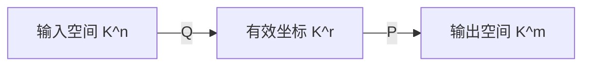

# 矩阵的秩

矩阵的秩（Rank）刻画线性映射有效输出的维数。它既可以从行列向量、非零子式或标准形定义，也直接控制线性方程组的自由度。

## 等价定义

对 $A\in K^{m\times n}$，以下数值相等：

- 列向量组的秩；
- 行向量组的秩；
- $A$ 的非零子式的最高阶数；
- $A$ 经初等变换化成阶梯形后非零行的数目。

这个共同的数记为 $\operatorname{rank}(A)$。若 $r=\operatorname{rank}(A)$，则存在可逆矩阵 $P,Q$，使

$$
PAQ=
\begin{pmatrix}
I_r&0\\0&0
\end{pmatrix}.
$$

因此两个同型矩阵相抵，当且仅当它们的秩相同。

!!! note "初等变换为什么不改变秩"
    行初等变换相当于左乘可逆矩阵，列初等变换相当于右乘可逆矩阵。可逆线性变换不会改变向量组的线性相关性，因此也不改变秩。

## 基本性质

$$
\operatorname{rank}(A)
=\operatorname{rank}(A^{\mathrm T})
\le\min\{m,n\}.
$$

若 $P,Q$ 可逆，则

$$
\operatorname{rank}(PAQ)=\operatorname{rank}(A).
$$

对实矩阵 $A$，

$$
\operatorname{rank}(A^{\mathrm T}A)
=\operatorname{rank}(AA^{\mathrm T})
=\operatorname{rank}(A).
$$

证明只需比较零空间：

$$
A^{\mathrm T}Ax=0
\Longrightarrow
x^{\mathrm T}A^{\mathrm T}Ax=\|Ax\|^2=0
\Longrightarrow Ax=0.
$$

### 子矩阵的秩

子矩阵的秩不超过原矩阵。反过来，若 $A\in K^{m\times n}$ 的秩为 $r$，从中任取 $s$ 行组成矩阵 $B$，则

$$
\operatorname{rank}(B)\ge r+s-m.
$$

这是因为删除一行最多使秩下降 $1$。

## 和、拼接与乘积

### 矩阵之和

同型矩阵满足

$$
\operatorname{rank}(A+B)
\le\operatorname{rank}(A)+\operatorname{rank}(B).
$$

### 行列拼接

$$
\max\{\operatorname{rank}(A),\operatorname{rank}(B)\}
\le\operatorname{rank}(A,B)
\le\operatorname{rank}(A)+\operatorname{rank}(B).
$$

对分块矩阵，还有

$$
\operatorname{rank}
\begin{pmatrix}A&0\\C&B\end{pmatrix}
\ge\operatorname{rank}(A)+\operatorname{rank}(B).
$$

### 矩阵乘积

若乘法有定义，则

$$
\operatorname{rank}(AB)
\le\min\{\operatorname{rank}(A),\operatorname{rank}(B)\}.
$$

因为 $AB$ 的每一列都是 $A$ 的列向量的线性组合；转置后可得到关于 $B$ 的另一侧估计。

若 $A\in K^{m\times n}$、$B\in K^{n\times s}$，Sylvester 秩不等式为

$$
\operatorname{rank}(AB)
\ge\operatorname{rank}(A)+\operatorname{rank}(B)-n.
$$

把上下界合并：

$$
\operatorname{rank}(A)+\operatorname{rank}(B)-n
\le\operatorname{rank}(AB)
\le\min\{\operatorname{rank}(A),\operatorname{rank}(B)\}.
$$

!!! example "$AB=0$ 时"
    若 $AB=0$，则 $B$ 的像空间包含在 $A$ 的零空间中：

    $$
    \operatorname{Im}B\subseteq\ker A.
    $$

    因而

    $$
    \operatorname{rank}(B)
    \le n-\operatorname{rank}(A),
    $$

    即 $\operatorname{rank}(A)+\operatorname{rank}(B)\le n$。

## 秩一矩阵与秩分解

非零矩阵 $A$ 的秩为 $1$，当且仅当它能写成

$$
A=uv^{\mathrm T},
$$

其中 $u,v$ 都是非零列向量。

更一般地，若 $\operatorname{rank}(A)=r$，则存在满列秩矩阵 $P\in K^{m\times r}$ 和满行秩矩阵 $Q\in K^{r\times n}$，使

$$
A=PQ.
$$

这称为满秩分解。它可以理解为：先把输入压缩到一个 $r$ 维坐标空间，再把这 $r$ 个有效方向映射到输出空间。

## 特殊矩阵的秩结论

若 $A^2=A$，则

$$
\operatorname{rank}(A)+\operatorname{rank}(I-A)=n.
$$

事实上 $\operatorname{Im}A=\ker(I-A)$、$\ker A=\operatorname{Im}(I-A)$，并且

$$
K^n=\operatorname{Im}A\oplus\ker A.
$$

若 $A^2=I$，则

$$
(A+I)(A-I)=0.
$$

利用乘积为零的秩估计以及 $(A+I)+(I-A)=2I$，可得

$$
\operatorname{rank}(A+I)+\operatorname{rank}(I-A)=n.
$$

伴随矩阵的秩只可能是 $n$、$1$ 或 $0$；具体分类见[行列式与矩阵运算](matrices-and-determinants.md#adjugate-matrix)。

## 与线性方程组的联系

秩决定线性映射的像空间维数，而秩—零化度定理决定零空间维数：

$$
\dim\operatorname{Im}A=\operatorname{rank}(A),
\qquad
\dim\ker A=n-\operatorname{rank}(A).
$$

因此计算方程组时，可以用同一次消元同时得到：

- 系数矩阵的秩；
- 方程是否相容；
- 主变量和自由变量；
- 齐次方程的基础解系。

完整判定见[向量组与线性方程组](vector-spaces-and-linear-systems.md#linear-system-solvability)。
