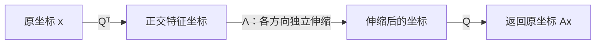

# 正交性与实对称矩阵

正交变换保持长度和夹角，实对称矩阵则拥有最稳定的谱结构：特征值全为实数，并且存在正交特征向量基。二者结合得到实对称矩阵的谱定理。

## 内积、范数与正交

在 $\mathbb R^n$ 中，标准内积和范数为

$$
\langle x,y\rangle=x^{\mathrm T}y,
\qquad
\|x\|=\sqrt{x^{\mathrm T}x}.
$$

若 $\langle x,y\rangle=0$，则称 $x$ 与 $y$ 正交。长度为 $1$ 的向量称为单位向量；两两正交的单位向量组称为标准正交组。

### Gram–Schmidt 正交化

给定线性无关向量 $\alpha_1,\ldots,\alpha_n$，令

$$
\begin{aligned}
\beta_1&=\alpha_1,\\
\beta_k&=\alpha_k-
\sum_{j=1}^{k-1}
\frac{\langle\alpha_k,\beta_j\rangle}
{\langle\beta_j,\beta_j\rangle}\beta_j,
\qquad k\ge2.
\end{aligned}
$$

再取 $q_k=\beta_k/\|\beta_k\|$，即可得到一组标准正交基。矩阵形式中，这一过程对应 QR 分解

$$
A=QR,
$$

其中 $Q$ 的列标准正交，$R$ 为上三角矩阵。

## 正交矩阵

实方阵 $Q$ 称为正交矩阵（Orthogonal Matrix），若

$$
Q^{\mathrm T}Q=I.
$$

以下条件等价：

- $Q^{\mathrm T}Q=I$；
- $QQ^{\mathrm T}=I$；
- $Q^{-1}=Q^{\mathrm T}$；
- $Q$ 的列向量构成标准正交基；
- $Q$ 的行向量构成标准正交基。

其行列式满足

$$
(\det Q)^2=1,
\qquad \det Q=\pm1.
$$

正交变换保持内积：

$$
\langle Qx,Qy\rangle
=x^{\mathrm T}Q^{\mathrm T}Qy
=\langle x,y\rangle.
$$

因此它同时保持长度、距离和夹角。$\det Q=1$ 的正交变换表示旋转的组合；$\det Q=-1$ 时还包含一次反射。

!!! warning "列向量单位化还不够"
    每一列长度为 $1$ 只能保证 $Q^{\mathrm T}Q$ 的对角元为 $1$。要使 $Q$ 正交，不同列之间还必须两两正交。

## 实对称矩阵的谱性质

设 $A\in\mathbb R^{n\times n}$ 且 $A^{\mathrm T}=A$。

### 特征值均为实数

若允许复特征向量 $z\ne0$，且 $Az=\lambda z$，则

$$
z^*Az=\lambda z^*z.
$$

由于 $A$ 是实对称矩阵，$z^*Az$ 为实数，而 $z^*z>0$，故 $\lambda\in\mathbb R$。

### 不同特征值的特征向量正交

设

$$
Au=\lambda u,
\qquad
Av=\mu v.
$$

由对称性，

$$
\lambda\langle u,v\rangle
=\langle Au,v\rangle
=\langle u,Av\rangle
=\mu\langle u,v\rangle.
$$

若 $\lambda\ne\mu$，则 $\langle u,v\rangle=0$。

## 谱定理

每个实对称矩阵都可以被正交对角化：存在正交矩阵 $Q$，使

$$
Q^{\mathrm T}AQ
=\Lambda
=\operatorname{diag}(\lambda_1,\ldots,\lambda_n).
$$

等价地，

$$
A=Q\Lambda Q^{\mathrm T}.
$$

若 $Q=(q_1,\ldots,q_n)$，则得到谱分解

$$
A=\sum_{i=1}^n\lambda_iq_iq_i^{\mathrm T}.
$$

其中 $q_iq_i^{\mathrm T}$ 是到特征方向 $\operatorname{span}(q_i)$ 的正交投影矩阵。

由谱分解立即得到

$$
\operatorname{tr}(A)=\sum_{i=1}^n\lambda_i,
\qquad
\det A=\prod_{i=1}^n\lambda_i,
\qquad
\operatorname{rank}(A)=\#\{i:\lambda_i\ne0\}.
$$

!!! info "为什么正交对角化格外重要"
    一般相似变换会扭曲长度和夹角，而正交换基只是旋转或反射坐标系。它既把矩阵化为对角形，又完整保留欧氏几何结构。
