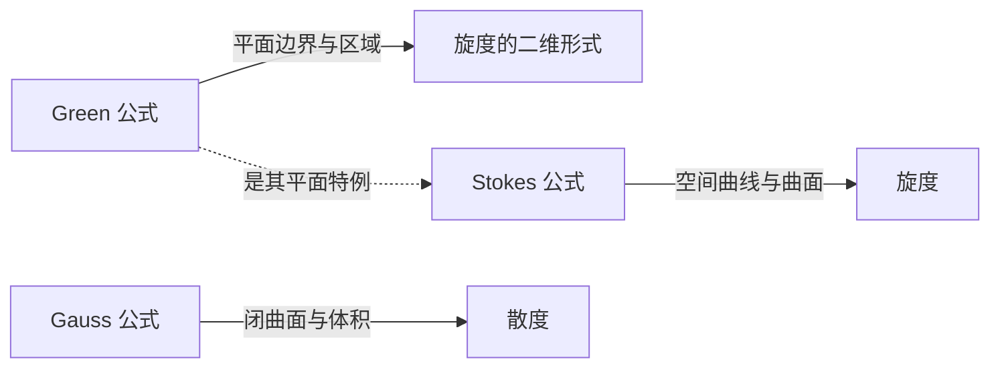

# 曲线积分与曲面积分

曲线积分和曲面积分把积分对象从区间、平面区域推广到曲线与曲面。第一类积分累加标量密度，与方向无关；第二类积分描述向量场沿路径的功或穿过曲面的通量，与方向或定向有关。

## 第一类曲线积分

设平面曲线 $L$ 上分布着线密度 $f(x,y)$，则总质量为

$$
\int_Lf(x,y)\,\mathrm ds.
$$

若曲线参数化为

$$
x=x(t),\qquad y=y(t),
\qquad \alpha\le t\le\beta,
$$

则

$$
\int_Lf(x,y)\,\mathrm ds
=\int_\alpha^\beta
f(x(t),y(t))
\sqrt{[x'(t)]^2+[y'(t)]^2}\,\mathrm dt.
$$

空间曲线 $x=x(t)$、$y=y(t)$、$z=z(t)$ 对应为

$$
\int_Lf\,\mathrm ds
=\int_\alpha^\beta f(x(t),y(t),z(t))
\sqrt{x'^2+y'^2+z'^2}\,\mathrm dt.
$$

第一类曲线积分具有线性性、区间可加性和对称性，并且与曲线的行进方向无关。

## 第二类曲线积分

在向量场

$$
\boldsymbol F=(P,Q,R)
$$

中，沿有向空间曲线 $L$ 移动所做的功为

$$
\int_L\boldsymbol F\cdot\mathrm d\boldsymbol r
=\int_LP\,\mathrm dx+Q\,\mathrm dy+R\,\mathrm dz.
$$

若 $L$ 由 $\boldsymbol r(t)=(x(t),y(t),z(t))$ 参数化，且参数增大方向与曲线正向一致，则

$$
\int_L\boldsymbol F\cdot\mathrm d\boldsymbol r
=\int_\alpha^\beta
\bigl(Px'+Qy'+Rz'\bigr)\,\mathrm dt.
$$

反转曲线方向时，第二类曲线积分变号。

### 两类曲线积分的联系

设曲线正向单位切向量的方向余弦为

$$
\left(\frac{\mathrm dx}{\mathrm ds},
\frac{\mathrm dy}{\mathrm ds},
\frac{\mathrm dz}{\mathrm ds}\right)
=(\cos\alpha,\cos\beta,\cos\gamma),
$$

则

$$
\int_LP\,\mathrm dx+Q\,\mathrm dy+R\,\mathrm dz
=\int_L
(P\cos\alpha+Q\cos\beta+R\cos\gamma)\,\mathrm ds.
$$

## Green 公式

设 $D$ 是由分段光滑简单闭曲线 $L$ 围成的平面区域，$L$ 取正向，即沿边界行进时区域始终位于左侧。若 $P,Q$ 在包含 $D$ 的区域内具有连续一阶偏导数，则

$$
\oint_LP\,\mathrm dx+Q\,\mathrm dy
=\iint_D
\left(
\frac{\partial Q}{\partial x}
-\frac{\partial P}{\partial y}
\right)\mathrm dx\,\mathrm dy.
$$

Green 公式把闭曲线积分转化为二重积分。若边界方向为负向，结果整体变号。

对于多连通区域，外边界取逆时针方向，内边界取顺时针方向，使区域始终位于行进方向左侧。

???+ example "用 Green 公式求面积"
    取 $P=-y/2$、$Q=x/2$，则

    $$
    \frac{\partial Q}{\partial x}
    -\frac{\partial P}{\partial y}=1.
    $$

    因而平面区域 $D$ 的面积可写成

    $$
    \operatorname{Area}(D)
    =\frac12\oint_{\partial D}(x\,\mathrm dy-y\,\mathrm dx).
    $$

## 路径无关与全微分

在单连通区域 $D$ 中，若 $P,Q$ 具有连续一阶偏导数，则下列条件等价：

1. 对 $D$ 中任意闭曲线 $L$，

    $$
    \oint_LP\,\mathrm dx+Q\,\mathrm dy=0;
    $$

2. 曲线积分只依赖起点与终点，与路径无关；
3. 存在势函数 $u(x,y)$，使

    $$
    \mathrm du=P\,\mathrm dx+Q\,\mathrm dy;
    $$

4. 在 $D$ 内处处满足

    $$
    \frac{\partial P}{\partial y}
    =\frac{\partial Q}{\partial x}.
    $$

!!! warning "混合偏导相等需要区域条件"
    $P_y=Q_x$ 在单连通区域上足以推出路径无关；若区域有孔，该条件可能不够，还必须检查绕孔闭曲线的积分。

若势函数存在，可以固定基点 $(x_0,y_0)$ 并定义

$$
u(x,y)=\int_{(x_0,y_0)}^{(x,y)}P\,\mathrm dx+Q\,\mathrm dy.
$$

由于积分与路径无关，可选择由水平线段和竖直线段组成的方便路径计算。

## 第一类曲面积分

若曲面 $\Sigma$ 上分布着面密度 $f(x,y,z)$，则总量为

$$
\iint_\Sigma f(x,y,z)\,\mathrm dS.
$$

若曲面参数化为

$$
\boldsymbol r=\boldsymbol r(u,v),
\qquad (u,v)\in D,
$$

则面积元为

$$
\mathrm dS=
|\boldsymbol r_u\times\boldsymbol r_v|\,\mathrm du\,\mathrm dv,
$$

从而

$$
\iint_\Sigma f\,\mathrm dS
=\iint_D
f(\boldsymbol r(u,v))
|\boldsymbol r_u\times\boldsymbol r_v|\,\mathrm du\,\mathrm dv.
$$

若曲面为图形 $z=z(x,y)$，则

$$
\mathrm dS=
\sqrt{1+z_x^2+z_y^2}\,\mathrm dx\,\mathrm dy,
$$

因此

$$
\iint_\Sigma f\,\mathrm dS
=\iint_{D_{xy}}
f(x,y,z(x,y))
\sqrt{1+z_x^2+z_y^2}\,\mathrm dx\,\mathrm dy.
$$

取 $f\equiv1$ 即得到曲面面积。第一类曲面积分与曲面定向无关。

## 第二类曲面积分

设有向曲面 $\Sigma$ 的单位法向量为

$$
\boldsymbol n=(\cos\alpha,\cos\beta,\cos\gamma),
$$

向量场为 $\boldsymbol F=(P,Q,R)$。穿过曲面的通量为

$$
\iint_\Sigma\boldsymbol F\cdot\boldsymbol n\,\mathrm dS.
$$

坐标形式为

$$
\iint_\Sigma
P\,\mathrm dy\,\mathrm dz
+Q\,\mathrm dz\,\mathrm dx
+R\,\mathrm dx\,\mathrm dy.
$$

其中

$$
\cos\alpha\,\mathrm dS=\mathrm dy\,\mathrm dz,
\quad
\cos\beta\,\mathrm dS=\mathrm dz\,\mathrm dx,
\quad
\cos\gamma\,\mathrm dS=\mathrm dx\,\mathrm dy
$$

按所选定向取符号。反转法向量时，第二类曲面积分变号。

若 $\Sigma$ 为 $z=z(x,y)$ 且取向上法向，则

$$
\boldsymbol n\,\mathrm dS=(-z_x,-z_y,1)\,\mathrm dx\,\mathrm dy,
$$

所以

$$
\iint_\Sigma\boldsymbol F\cdot\boldsymbol n\,\mathrm dS
=\iint_{D_{xy}}
(-Pz_x-Qz_y+R)\,\mathrm dx\,\mathrm dy.
$$

## Gauss 公式

设闭曲面 $\Sigma$ 围成空间区域 $\Omega$，$\Sigma$ 取外侧定向；$P,Q,R$ 在相关区域中具有连续一阶偏导数。则

$$
\iint_\Sigma
P\,\mathrm dy\,\mathrm dz
+Q\,\mathrm dz\,\mathrm dx
+R\,\mathrm dx\,\mathrm dy
=\iiint_\Omega
\left(
\frac{\partial P}{\partial x}
+\frac{\partial Q}{\partial y}
+\frac{\partial R}{\partial z}
\right)\mathrm dV.
$$

向量形式为

$$
\iint_\Sigma\boldsymbol F\cdot\boldsymbol n\,\mathrm dS
=\iiint_\Omega\nabla\cdot\boldsymbol F\,\mathrm dV.
$$

若区域有空腔，所有边界都取相对于区域的外法向：外壳法向朝外，内壳法向朝向空腔。

## Stokes 公式

设有向曲面 $\Sigma$ 的边界为 $L=\partial\Sigma$，二者方向满足右手定则。若向量场 $\boldsymbol F=(P,Q,R)$ 足够光滑，则

$$
\oint_L\boldsymbol F\cdot\mathrm d\boldsymbol r
=\iint_\Sigma
(\nabla\times\boldsymbol F)\cdot\boldsymbol n\,\mathrm dS.
$$

展开为

$$
\oint_LP\,\mathrm dx+Q\,\mathrm dy+R\,\mathrm dz
=\iint_\Sigma
\begin{vmatrix}
\mathrm dy\,\mathrm dz&\mathrm dz\,\mathrm dx&\mathrm dx\,\mathrm dy\\
\dfrac{\partial}{\partial x}&\dfrac{\partial}{\partial y}&\dfrac{\partial}{\partial z}\\
P&Q&R
\end{vmatrix}.
$$

Green 公式可看作 Stokes 公式在平面上的特殊情形。

## 三个公式的统一关系

- Green：闭曲线积分转化为平面二重积分；
- Stokes：闭曲线环流转化为曲面上的旋度通量；
- Gauss：闭曲面通量转化为区域内的散度积分。

!!! tip "先确认积分对象与定向"
    使用公式前先判断对象是开曲线、闭曲线、开曲面还是闭曲面，再检查边界方向、法向方向和投影符号。多数符号错误并非积分计算造成，而是定向约定不一致。
