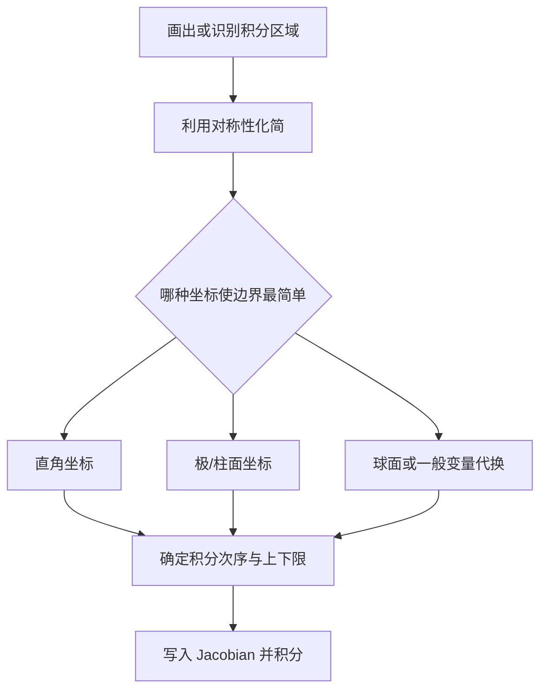

# 重积分

重积分把一元定积分的“分割、近似求和、取极限”推广到平面区域和空间区域。计算的关键是准确描述积分区域，并选择使边界最简单的积分次序或坐标系。

## 二重积分

设有界函数 $f(x,y)$ 定义在有界闭区域 $D$ 上。把 $D$ 分成若干小区域 $\Delta\sigma_i$，在每块中任取 $(\xi_i,\eta_i)$。若当分割的最大直径趋于零时，和式

$$
\sum_i f(\xi_i,\eta_i)\Delta\sigma_i
$$

趋于与分割和取点方式无关的极限，则称 $f$ 在 $D$ 上可积，并记为

$$
\iint_D f(x,y)\,\mathrm d\sigma.
$$

当 $f\ge0$ 时，它可以表示以 $D$ 为底、$z=f(x,y)$ 为顶的曲顶柱体体积。

连续函数在有界闭区域上可积；更一般地，有界且间断点足够少的函数也可积。

## 基本性质与对称性

重积分具有线性性、区域可加性、保序性和绝对值不等式。若 $f$ 连续，则存在 $(\xi,\eta)\in D$ 使

$$
\iint_Df(x,y)\,\mathrm d\sigma
=f(\xi,\eta)\operatorname{Area}(D).
$$

对称区域上可先检查奇偶性。例如 $D$ 关于 $y$ 轴对称：

- 若 $f(-x,y)=-f(x,y)$，则积分为 $0$；
- 若 $f(-x,y)=f(x,y)$，则可在右半区域积分后乘 $2$。

## 直角坐标下的累次积分

若区域可写成 $x$ 型区域

$$
D=\{(x,y):a\le x\le b,\ \varphi_1(x)\le y\le\varphi_2(x)\},
$$

则

$$
\iint_Df(x,y)\,\mathrm dx\,\mathrm dy
=\int_a^b\!\mathrm dx
\int_{\varphi_1(x)}^{\varphi_2(x)}f(x,y)\,\mathrm dy.
$$

若区域可写成 $y$ 型区域

$$
D=\{(x,y):c\le y\le d,\ \psi_1(y)\le x\le\psi_2(y)\},
$$

则

$$
\iint_Df(x,y)\,\mathrm dx\,\mathrm dy
=\int_c^d\!\mathrm dy
\int_{\psi_1(y)}^{\psi_2(y)}f(x,y)\,\mathrm dx.
$$

交换积分次序时，应重新从区域的几何投影写出全部边界，不能只交换积分符号中的上下限。

???+ example "交换积分次序"
    对区域

    $$
    0\le x\le1,\qquad x\le y\le1,
    $$

    原积分次序为

    $$
    \int_0^1\!\mathrm dx\int_x^1f(x,y)\,\mathrm dy.
    $$

    改从 $y$ 轴投影，可写成 $0\le y\le1$、$0\le x\le y$，故

    $$
    \int_0^1\!\mathrm dy\int_0^yf(x,y)\,\mathrm dx.
    $$

## 极坐标变换

令

$$
x=r\cos\theta,
\qquad
y=r\sin\theta,
$$

则面积元为

$$
\mathrm dx\,\mathrm dy=r\,\mathrm dr\,\mathrm d\theta.
$$

因此

$$
\iint_Df(x,y)\,\mathrm dx\,\mathrm dy
=\iint_{D'}f(r\cos\theta,r\sin\theta)
r\,\mathrm dr\,\mathrm d\theta.
$$

圆、扇形、圆环以及含 $x^2+y^2$ 的被积函数通常适合使用极坐标。

!!! warning "不要漏掉 Jacobian 因子 $r$"
    极坐标下的小面积不是 $\mathrm dr\,\mathrm d\theta$，而是 $r\,\mathrm dr\,\mathrm d\theta$。这个伸缩因子来自坐标变换的 Jacobian。

## 一般变量代换

若

$$
x=x(u,v),\qquad y=y(u,v),
$$

且变换在相关区域内一一对应并足够光滑，则

$$
\mathrm dx\,\mathrm dy
=\left|\frac{\partial(x,y)}{\partial(u,v)}\right|
\mathrm du\,\mathrm dv,
$$

其中

$$
\frac{\partial(x,y)}{\partial(u,v)}
=
\begin{vmatrix}
x_u&x_v\\
y_u&y_v
\end{vmatrix}.
$$

应使用 Jacobian 的绝对值，因为面积元必须非负。一般曲线坐标适合把弯曲边界化成矩形边界。

## 二重积分的应用

若平面薄片占据区域 $D$，面密度为 $\rho(x,y)$，则质量为

$$
M=\iint_D\rho(x,y)\,\mathrm d\sigma.
$$

质心坐标为

$$
\bar x=\frac1M\iint_Dx\rho(x,y)\,\mathrm d\sigma,
\qquad
\bar y=\frac1M\iint_Dy\rho(x,y)\,\mathrm d\sigma.
$$

曲顶柱体 $z_1(x,y)\le z\le z_2(x,y)$ 的体积为

$$
V=\iint_D\bigl(z_2(x,y)-z_1(x,y)\bigr)\,\mathrm d\sigma.
$$

## 三重积分

对空间区域 $\Omega$，三重积分记为

$$
\iiint_\Omega f(x,y,z)\,\mathrm dV.
$$

当 $f\equiv1$ 时得到区域体积；若 $f$ 是体密度，则积分表示质量。

若区域可沿 $z$ 方向投影为

$$
(x,y)\in D,
\qquad z_1(x,y)\le z\le z_2(x,y),
$$

则

$$
\iiint_\Omega f\,\mathrm dV
=\iint_D\mathrm dx\,\mathrm dy
\int_{z_1(x,y)}^{z_2(x,y)}f(x,y,z)\,\mathrm dz.
$$

也可以先固定一个坐标作截面，再对截面积分。选择积分次序时，应优先让投影区域和上下界简单。

## 柱面坐标与球面坐标

柱面坐标为

$$
x=r\cos\theta,
\qquad y=r\sin\theta,
\qquad z=z,
$$

体积元为

$$
\mathrm dV=r\,\mathrm dr\,\mathrm d\theta\,\mathrm dz.
$$

球面坐标采用约定

$$
x=r\sin\varphi\cos\theta,
\quad
y=r\sin\varphi\sin\theta,
\quad
z=r\cos\varphi,
$$

其中 $r\ge0$、$0\le\theta<2\pi$、$0\le\varphi\le\pi$。体积元为

$$
\mathrm dV=r^2\sin\varphi\,
\mathrm dr\,\mathrm d\varphi\,\mathrm d\theta.
$$

| 几何特征 | 优先坐标系 |
| --- | --- |
| 绕 $z$ 轴旋转对称、边界含 $x^2+y^2$ | 柱面坐标 |
| 球、球冠、圆锥与球的组合 | 球面坐标 |
| 边界主要由平面或坐标面构成 | 直角坐标 |

!!! note "角度约定要保持一致"
    本文用 $\varphi$ 表示与正 $z$ 轴的夹角。不同教材可能交换 $\theta$ 与 $\varphi$ 的含义，套用体积元和积分上下限前应先确认约定。

## 计算策略

