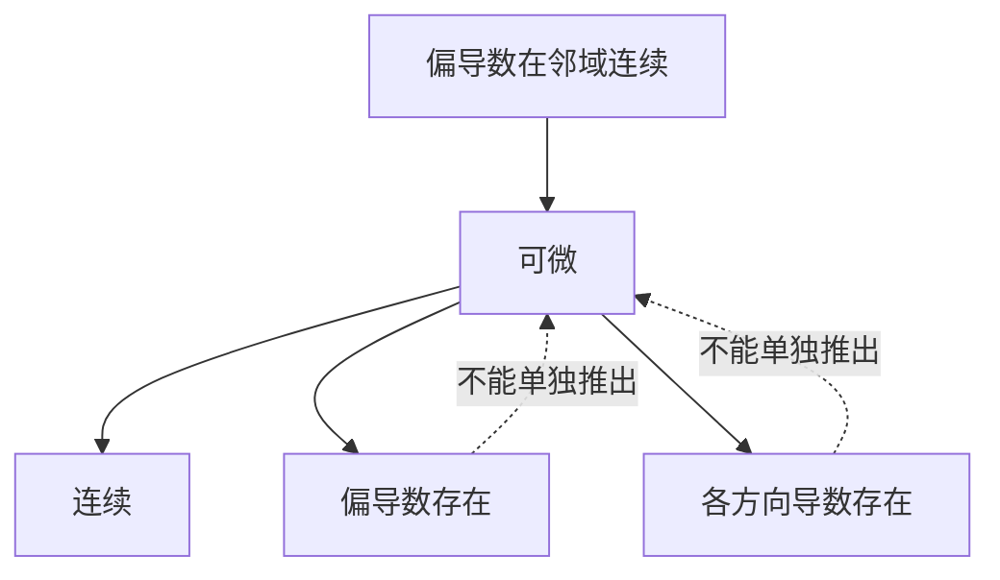

# 多元函数微分学

多元函数把一元函数的极限、连续与微分推广到平面或空间。最大的变化是：自变量可以沿无穷多条路径接近一点，因此偏导数只能描述坐标方向上的变化，全微分才给出完整的局部线性近似。

## 邻域、区域与极限

点 $P_0=(x_0,y_0)$ 的 $\delta$ 邻域为

$$
U(P_0,\delta)
=\left\{(x,y):\sqrt{(x-x_0)^2+(y-y_0)^2}<\delta\right\}.
$$

开集
: 集合中的每一点都有一个完全包含在集合内的邻域。

区域
: 连通的开集。区域连同其部分或全部边界常称为闭区域。

设 $f$ 在 $P_0$ 的某个去心邻域内有定义。若

$$
\forall\varepsilon>0,\ \exists\delta>0,
\quad 0<\sqrt{(x-x_0)^2+(y-y_0)^2}<\delta
\Longrightarrow |f(x,y)-A|<\varepsilon,
$$

则记

$$
\lim_{(x,y)\to(x_0,y_0)}f(x,y)=A.
$$

!!! warning "多元极限必须与路径无关"
    沿直线、抛物线或其他某几条路径得到相同极限，只能提供必要信息，不能证明二重极限存在。若找到两条路径得到不同结果，则可以立即判定极限不存在。

## 连续与偏导数

若

$$
\lim_{(x,y)\to(x_0,y_0)}f(x,y)=f(x_0,y_0),
$$

则称 $f$ 在 $(x_0,y_0)$ 连续。

固定 $y=y_0$，若极限

$$
f_x(x_0,y_0)
=\lim_{\Delta x\to0}
\frac{f(x_0+\Delta x,y_0)-f(x_0,y_0)}{\Delta x}
$$

存在，则称其为 $f$ 对 $x$ 的偏导数。类似地定义 $f_y(x_0,y_0)$。

偏导数只考察平行于坐标轴的两条路径。两个偏导数都存在，既不能保证函数连续，也不能保证函数可微。

## 方向导数与梯度

令单位向量

$$
\boldsymbol e=(\cos\alpha,\cos\beta).
$$

$f$ 在 $P_0$ 沿方向 $\boldsymbol e$ 的方向导数定义为

$$
\frac{\partial f}{\partial\boldsymbol e}(P_0)
=\lim_{t\to0^+}
\frac{f(P_0+t\boldsymbol e)-f(P_0)}t.
$$

若 $f$ 在 $P_0$ 可微，则

$$
\frac{\partial f}{\partial\boldsymbol e}
=f_x\cos\alpha+f_y\cos\beta.
$$

梯度定义为

$$
\nabla f=(f_x,f_y).
$$

因此

$$
\frac{\partial f}{\partial\boldsymbol e}
=\nabla f\cdot\boldsymbol e.
$$

梯度方向是函数增长最快的方向，最大方向导数为 $|\nabla f|$；与梯度相反的方向下降最快。

## 全微分与可微性

令

$$
\Delta z=f(x_0+\Delta x,y_0+\Delta y)-f(x_0,y_0),
$$

$$
\rho=\sqrt{(\Delta x)^2+(\Delta y)^2}.
$$

若存在与 $\Delta x,\Delta y$ 无关的常数 $A,B$，使

$$
\Delta z=A\Delta x+B\Delta y+o(\rho),
$$

则称 $f$ 在 $(x_0,y_0)$ 可微。此时

$$
A=f_x(x_0,y_0),\qquad B=f_y(x_0,y_0),
$$

全微分为

$$
\mathrm dz=f_x\,\mathrm dx+f_y\,\mathrm dy.
$$

多元函数几个局部性质的关系为：

!!! note "常用充分条件"
    若 $f_x,f_y$ 在 $(x_0,y_0)$ 的某个邻域内存在，并且在该点连续，则 $f$ 在该点可微。这是充分条件，不是可微的必要条件。

## 复合函数求导

设

$$
z=f(u,v),\qquad u=u(x,y),\qquad v=v(x,y),
$$

并满足相应可微条件，则链式法则为

$$
\frac{\partial z}{\partial x}
=f_u\frac{\partial u}{\partial x}
+f_v\frac{\partial v}{\partial x},
$$

$$
\frac{\partial z}{\partial y}
=f_u\frac{\partial u}{\partial y}
+f_v\frac{\partial v}{\partial y}.
$$

若 $x=x(t)$、$y=y(t)$，则

$$
\frac{\mathrm dz}{\mathrm dt}
=f_x\frac{\mathrm dx}{\mathrm dt}
+f_y\frac{\mathrm dy}{\mathrm dt}.
$$

## 隐函数求导

若方程

$$
F(x,y)=0
$$

在点 $(x_0,y_0)$ 附近确定了可微函数 $y=y(x)$，且 $F_y(x_0,y_0)\ne0$，则

$$
\frac{\mathrm dy}{\mathrm dx}=-\frac{F_x}{F_y}.
$$

对方程 $F(x,y,z)=0$，若 $F_z\ne0$，它在局部确定 $z=z(x,y)$，并且

$$
z_x=-\frac{F_x}{F_z},
\qquad
z_y=-\frac{F_y}{F_z}.
$$

## 空间曲线的切线与法平面

设空间曲线由

$$
x=x(t),\qquad y=y(t),\qquad z=z(t)
$$

给出。在 $t=t_0$ 处，若

$$
\boldsymbol T=(x'(t_0),y'(t_0),z'(t_0))\ne\boldsymbol0,
$$

则切线方程为

$$
\frac{x-x_0}{x'(t_0)}
=\frac{y-y_0}{y'(t_0)}
=\frac{z-z_0}{z'(t_0)},
$$

零分量对应的坐标应直接写成常数。法平面以 $\boldsymbol T$ 为法向量：

$$
x'(t_0)(x-x_0)+y'(t_0)(y-y_0)+z'(t_0)(z-z_0)=0.
$$

## 曲面的切平面与法线

设曲面由 $F(x,y,z)=0$ 给出，且 $\nabla F(P_0)\ne\boldsymbol0$。梯度

$$
\boldsymbol n=\nabla F(P_0)
=(F_x,F_y,F_z)\big|_{P_0}
$$

是曲面在 $P_0$ 处的法向量。切平面为

$$
F_x(P_0)(x-x_0)
+F_y(P_0)(y-y_0)
+F_z(P_0)(z-z_0)=0.
$$

法线方向即 $\nabla F(P_0)$。

## 无约束极值

若可微函数 $f(x,y)$ 在内点 $(x_0,y_0)$ 取得极值，则必要条件为

$$
f_x(x_0,y_0)=0,
\qquad
f_y(x_0,y_0)=0.
$$

满足该条件的点称为驻点。设在驻点处

$$
A=f_{xx},\qquad B=f_{xy},\qquad C=f_{yy},
\qquad \Delta=AC-B^2.
$$

若二阶偏导连续，则：

| 条件 | 结论 |
| --- | --- |
| $\Delta>0$ 且 $A>0$ | 严格局部极小值 |
| $\Delta>0$ 且 $A<0$ | 严格局部极大值 |
| $\Delta<0$ | 鞍点，不是极值 |
| $\Delta=0$ | 判别失效，需另行分析 |

闭区域上的最值还必须比较内部驻点与边界上的候选点。

## 条件极值与 Lagrange 乘数法

求 $f(x,y)$ 在约束

$$
\varphi(x,y)=0
$$

下的极值时，若约束曲线光滑且梯度非零，可以令

$$
L(x,y,\lambda)=f(x,y)+\lambda\varphi(x,y),
$$

并求解

$$
\begin{cases}
f_x+\lambda\varphi_x=0,\\
f_y+\lambda\varphi_y=0,\\
\varphi(x,y)=0.
\end{cases}
$$

其几何含义是：极值点处目标函数与约束函数的梯度平行。所得点只是候选点，仍需结合题目范围比较函数值。
