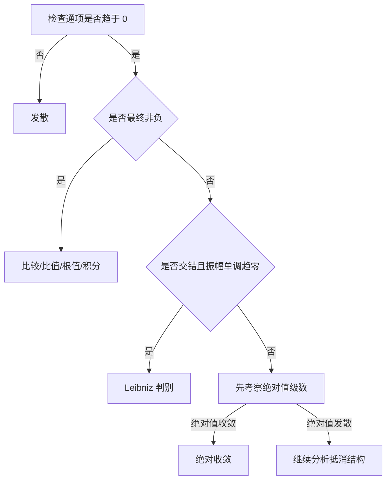

# 数项级数

数项级数把无穷多个数相加，其“和”由部分和数列的极限定义。判断级数敛散性的核心不是形式运算，而是控制尾项之和。

## 基本概念

给定数列 $\{u_n\}$，表达式

$$
\sum_{n=1}^{\infty}u_n=u_1+u_2+\cdots+u_n+\cdots
$$

称为数项级数。其前 $n$ 项部分和为

$$
S_n=\sum_{k=1}^{n}u_k.
$$

若部分和数列 $\{S_n\}$ 收敛，且 $S_n\to S$，则称级数收敛，和为 $S$；否则称级数发散。

当级数收敛时，第 $n$ 项之后的余项为

$$
R_n=\sum_{k=n+1}^{\infty}u_k=S-S_n,
$$

因此 $R_n\to0$。

### 基本性质

- 改变、增加或删去有限项不改变级数的敛散性；
- 在不改变顺序的前提下，把有限个相邻项分组，不改变收敛级数的和；
- 若 $\sum u_n$ 与 $\sum v_n$ 收敛，则

    $$
    \sum_{n=1}^{\infty}(\alpha u_n+\beta v_n)
    =\alpha\sum_{n=1}^{\infty}u_n
    +\beta\sum_{n=1}^{\infty}v_n.
    $$

!!! warning "拆组比合组更危险"
    收敛级数合并相邻有限项后仍收敛；反过来，一个分组后的级数收敛，原级数未必收敛。例如 $1-1+1-1+\cdots$ 两项一组后每组为零，但原部分和在 $1$ 与 $0$ 之间振荡。

## 收敛的必要条件与 Cauchy 准则

若 $\sum u_n$ 收敛，则

$$
u_n=S_n-S_{n-1}\to0.
$$

因此 $u_n\not\to0$ 时，级数一定发散。

!!! warning "$u_n\to0$ 不是充分条件"
    调和级数 $\sum 1/n$ 的通项趋于零，但级数发散。通项判别只能快速排除，不足以证明收敛。

级数 $\sum u_n$ 收敛，当且仅当

$$
\forall\varepsilon>0,\ \exists N,
\quad n>N,\ p\in\mathbb N_+
\Longrightarrow
\left|u_{n+1}+\cdots+u_{n+p}\right|<\varepsilon.
$$

这就是级数的 Cauchy 收敛准则，本质上是部分和数列的 Cauchy 准则。

## 正项级数

若 $u_n\ge0$，则部分和 $S_n$ 单调递增。因此

$$
\sum_{n=1}^{\infty}u_n\text{ 收敛}
\iff \{S_n\}\text{ 有上界}.
$$

### 比较判别法

若从某一项起 $0\le u_n\le v_n$，则：

- $\sum v_n$ 收敛可推出 $\sum u_n$ 收敛；
- $\sum u_n$ 发散可推出 $\sum v_n$ 发散。

若 $u_n,v_n>0$ 且

$$
\lim_{n\to\infty}\frac{u_n}{v_n}=L,
$$

则：

- $0<L<\infty$ 时，两级数同敛散；
- $L=0$ 时，$\sum v_n$ 收敛可推出 $\sum u_n$ 收敛；
- $L=+\infty$ 时，$\sum v_n$ 发散可推出 $\sum u_n$ 发散。

### 比值与根值判别法

若

$$
q=\lim_{n\to\infty}\frac{u_{n+1}}{u_n}
$$

存在，则 $q<1$ 时级数收敛，$q>1$ 时级数发散。若

$$
\rho=\lim_{n\to\infty}\sqrt[n]{u_n}
$$

存在，则 $\rho<1$ 时收敛，$\rho>1$ 时发散。

!!! note "临界值为 $1$ 时判别失效"
    $\sum 1/n$ 与 $\sum 1/n^2$ 的比值极限、根值极限都等于 $1$，但前者发散、后者收敛。此时必须换用比较法、积分判别法或更精细的判别法。

### Raabe 判别法

设 $u_n>0$，并且

$$
r=\lim_{n\to\infty}
n\left(1-\frac{u_{n+1}}{u_n}\right).
$$

若 $r>1$，则 $\sum u_n$ 收敛；若 $r<1$，则发散；$r=1$ 时不能据此判断。Raabe 判别法适合比值判别得到临界值 $1$ 的情形。

### 积分判别法

若 $f$ 在 $[1,+\infty)$ 上连续、非负且单调递减，且 $u_n=f(n)$，则

$$
\sum_{n=1}^{\infty}u_n
\quad\text{与}\quad
\int_1^{+\infty}f(x)\,\mathrm dx
$$

同敛散。

由此得到两类基准级数：

$$
\sum_{n=1}^{\infty}\frac1{n^p}
\begin{cases}
\text{收敛},&p>1,\\
\text{发散},&p\le1,
\end{cases}
$$

以及

$$
\sum_{n=2}^{\infty}\frac1{n(\ln n)^p}
\begin{cases}
\text{收敛},&p>1,\\
\text{发散},&p\le1.
\end{cases}
$$

## 交错级数

形如

$$
\sum_{n=1}^{\infty}(-1)^{n-1}u_n,
\qquad u_n\ge0
$$

的级数称为交错级数。

若 $u_n$ 从某一项起单调递减，且 $u_n\to0$，则由 Leibniz 判别法，交错级数收敛，并且余项满足

$$
|R_n|\le u_{n+1}.
$$

这不仅给出收敛性，还直接给出截断误差估计。

## 绝对收敛与条件收敛

绝对收敛
: 若 $\sum|u_n|$ 收敛，则称 $\sum u_n$ 绝对收敛。

条件收敛
: 若 $\sum u_n$ 收敛而 $\sum|u_n|$ 发散，则称其条件收敛。

绝对收敛必然推出原级数收敛。逆命题不成立，例如

$$
\sum_{n=1}^{\infty}\frac{(-1)^{n-1}}n
$$

条件收敛但不绝对收敛。

令

$$
u_n^+=\frac{|u_n|+u_n}{2},
\qquad
u_n^-=\frac{|u_n|-u_n}{2},
$$

则 $u_n=u_n^+-u_n^-$、$|u_n|=u_n^++u_n^-$。级数绝对收敛当且仅当其正部级数和负部级数都收敛。

!!! warning "重排只对绝对收敛安全"
    绝对收敛级数任意重排后仍收敛且和不变；条件收敛级数的重排可能改变和，甚至使其发散。

## Cauchy 乘积

设 $\sum a_n=A$、$\sum b_n=B$，定义

$$
c_n=\sum_{k=0}^{n}a_kb_{n-k}.
$$

若两个级数都绝对收敛，则 Cauchy 乘积级数绝对收敛，且

$$
\sum_{n=0}^{\infty}c_n=AB.
$$

若只知道两个级数普通收敛，不能直接保证乘积级数按上述方式收敛。

## 判别策略

实际判断时，先识别与 $1/n^p$、$1/[n(\ln n)^p]$ 或几何级数的等价阶，通常比盲目套用复杂判别法更直接。
