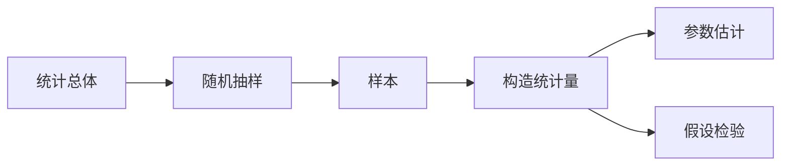

# 抽样与统计量

数理统计从总体中抽取样本，再利用样本所携带的信息估计或检验总体特征。典型流程是：设计抽样方案、收集随机数据、建立统计模型并进行统计推断。

## 总体与样本

总体（Population）
: 研究对象的全体，其数量特征由某个概率分布描述。若分布含有未知参数，可记为 $F(x;\boldsymbol\theta)$ 或 $f(x;\boldsymbol\theta)$。

样本（Sample）
: 按照既定规则从总体中抽取的个体。抽得的随机变量 $X_1,X_2,\ldots,X_n$ 构成容量为 $n$ 的样本。

简单随机样本
: $X_1,X_2,\ldots,X_n$ 相互独立，并且都与总体 $X$ 具有相同分布，即

    $$
    X_1,X_2,\ldots,X_n\overset{\mathrm{i.i.d.}}{\sim}F.
    $$

简单随机样本的联合分布函数为

$$
F(x_1,x_2,\ldots,x_n)
=\prod_{i=1}^{n}F(x_i).
$$

若总体密度为 $f$，样本联合密度为

$$
f(x_1,x_2,\ldots,x_n)
=\prod_{i=1}^{n}f(x_i).
$$

!!! note "有放回与不放回"
    有放回抽样天然保持各次抽取独立。不放回抽样一般会产生依赖；当总体很大而抽样比例很小时，常作近似独立处理。

## 常用统计量

统计量（Statistic）
: 只由样本 $X_1,\ldots,X_n$ 构成、不含任何未知参数的函数。

样本均值
: 

    $$
    \overline X=\frac1n\sum_{i=1}^{n}X_i.
    $$

样本方差
: 

    $$
    S^2=\frac1{n-1}\sum_{i=1}^{n}(X_i-\overline X)^2.
    $$

$k$ 阶样本原点矩
: 

    $$
    A_k=\frac1n\sum_{i=1}^{n}X_i^k.
    $$

$k$ 阶样本中心矩
: 

    $$
    M_k=\frac1n\sum_{i=1}^{n}(X_i-\overline X)^k.
    $$

!!! info "$n-1$ 的作用"
    使用分母 $n-1$ 时，样本方差对总体方差无偏：$E(S^2)=\sigma^2$。若改用分母 $n$，得到的二阶样本中心矩 $M_2$ 满足

    $$
    E(M_2)=\frac{n-1}{n}\sigma^2,
    $$

    但随着 $n\to\infty$，$M_2\xrightarrow{P}\sigma^2$。

## 估计量的评价标准

设 $\widehat\theta$ 是未知参数 $\theta$ 的估计量。

无偏性
: 若 $E(\widehat\theta)=\theta$，则称 $\widehat\theta$ 是 $\theta$ 的无偏估计量。

最小方差无偏估计
: 在所有无偏估计量中方差最小的估计量。

相合性
: 若对任意 $\varepsilon>0$，

    $$
    P(|\widehat\theta_n-\theta|\ge\varepsilon)\to0,
    $$

    则称 $\widehat\theta_n$ 是 $\theta$ 的相合估计量。

渐近正态性
: 若存在适当的标准化，使估计量的极限分布为正态分布，则称估计量具有渐近正态性。它为大样本区间估计和假设检验提供依据。

## 三个重要的抽样分布

后续统计推断主要使用 $\chi^2$、$t$ 和 $F$ 分布。

### $\chi^2$ 分布

设 $Z_1,\ldots,Z_n$ 相互独立，且 $Z_i\sim N(0,1)$。若

$$
X=\sum_{i=1}^{n}Z_i^2,
$$

则称 $X$ 服从自由度为 $n$ 的卡方分布，记作

$$
X\sim\chi^2(n).
$$

卡方分布只取非负值，且随自由度增大逐渐趋于对称。

### $t$ 分布

设

$$
Z\sim N(0,1),\qquad X\sim\chi^2(n),\qquad Z\perp X.
$$

则

$$
T=\frac{Z}{\sqrt{X/n}}
$$

服从自由度为 $n$ 的 $t$ 分布，记作 $T\sim t(n)$。

$t$ 分布关于零对称，尾部比标准正态分布更厚；自由度增大时逐渐接近 $N(0,1)$。

### $F$ 分布

设

$$
X\sim\chi^2(m),\qquad Y\sim\chi^2(n),\qquad X\perp Y.
$$

则

$$
F=\frac{X/m}{Y/n}
$$

服从自由度为 $(m,n)$ 的 $F$ 分布，记作 $F\sim F(m,n)$。

它满足倒数关系

$$
F\sim F(m,n)
\quad\Longrightarrow\quad
\frac1F\sim F(n,m).
$$

## 正态总体的抽样分布

设 $X_1,\ldots,X_n$ 是来自 $N(\mu,\sigma^2)$ 的简单随机样本，则：

1. 样本均值仍服从正态分布：

    $$
    \overline X\sim N\left(\mu,\frac{\sigma^2}{n}\right).
    $$

2. 样本均值与样本方差相互独立：

    $$
    \overline X\perp S^2.
    $$

3. 样本方差标准化后服从卡方分布：

    $$
    \frac{(n-1)S^2}{\sigma^2}\sim\chi^2(n-1).
    $$

4. 当 $\sigma^2$ 未知时，

    $$
    T=\frac{\overline X-\mu}{S/\sqrt n}\sim t(n-1).
    $$

这些结论把样本统计量与已知分布连接起来，是构造枢轴量的基础。

## 分位数记号

本课程统一用“左侧累计概率”定义分位数：

$$
P(Z\le z_p)=p,\qquad Z\sim N(0,1),
$$

$$
P(T\le t_{p,\nu})=p,\qquad T\sim t(\nu),
$$

$$
P(Q\le\chi^2_{p,\nu})=p,\qquad Q\sim\chi^2(\nu),
$$

$$
P(F\le F_{p,\nu_1,\nu_2})=p,\qquad F\sim F(\nu_1,\nu_2).
$$

!!! warning "先确认分位数约定"
    有些教材把 $u_\alpha$、$t_\alpha$ 定义为“右尾概率为 $\alpha$”的上侧分位数。本文改用左侧累计概率下标，因此双侧区间使用 $1-\alpha/2$ 分位数。套表时必须先确认教材的记号约定。

*[i.i.d.]: independent and identically distributed，独立同分布
